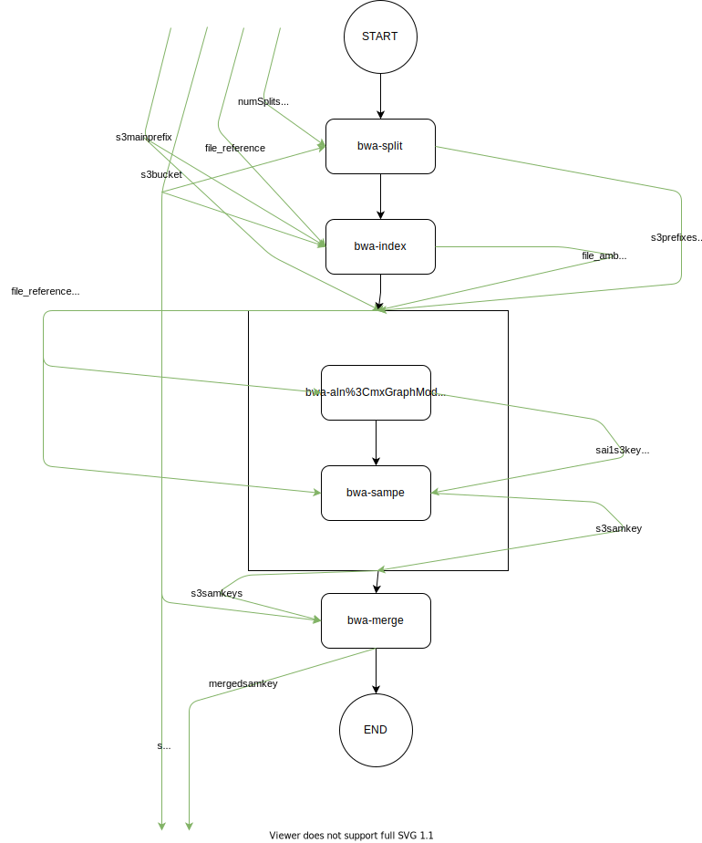

# BWA

BWA is a common life sciences task of performing DNA read alignment.

#### Overview

This repository contains a parallel implementation of BWA, orchestrated with the Abstract Function Choreography Language and runnable on the [xAFCL Enactment Engine](https://github.com/sashkoristov/enactmentengine)

There are two workflows flavors, `workflow*` and `workflow-slim`:
* `workflows` are runnable, and well-tested on the current version of xAFCL.
* `workflows-slim` are aspirational workflows where the dataflow is optimized to its theoretical limit, but are not tested on the current version of xAFCL.




**Fig 1: workflow-slim.yaml control and data flow**


#### Get the code

```
git clone https://github.com/Apollo-Workflows/BWA
cd BWA
```

#### Get an input dataset

Name | Description  | Bucket | Keys
---|----|-----|----
Escherichia Coli | A gram-negative bacterium that can cause food poisoning. The Assembly used is ASM584v2, with a double mutation in gene `hipA`. |  `jak-bwa-bucket` | `input/NC_000913.3-hipA7.fasta`<br>`input/reads/hipa7_reads_R1.fastq`<br>`input/reads/hipa7_reads_R2.fastq` 
Trypanosoma brucei | A single-cell organism that causes sleeping sickness in humans. The Assembly used is ASM244v1. |  `jak-bwa-bucket` | `t-brucei/ASM244v1.fasta`<br>`t-brucei/reads/asm_reads_R1.fastq`<br>`t-brucei/reads/asm_reads_R2.fastq`
Rhizobium jaguaris | A nitrogen-fixing soil bacterium isolated in Mexico. The Assembly used is ASM362775v1.  |  `jak-bwa-bucket` | `rhi-jaguaris/rhizobium-jaguaris.fasta`<br>`rhi-jaguaris/rhi_jaguaris_reads_R1.fastq`<br>`rhi-jaguaris/rhi_jaguaris_reads_R2.fastq`
Bacteroides thetaiotaomicron | An anaerobic bacterium very common in the gut of humans and other mammals. The Assembly used is ASM1413175v1. |  `jak-bwa-bucket` | `bac-thet/bac_thetaiotamicron.fasta`<br>`bac-thet/bac_thetaiotamicron_reads_R1.fastq`<br>`bac-thet/bac_thetaiotamicron_reads_R2.fastq`


Put any three files in a S3 bucket of yours, ideally in the same region as the Lambdas will be in.
Update `input.json` with the bucket and the keys of your DNA samples, and the desired parallelism:

```
{
  "s3bucket": "YOUR_BUCKET",
  "files": {
    "reference": "YOUR_KEY_OF_REFERENCE_GENOME.fasta",
    "r1": "YOUR_KEY_OF_reads_R1.fastq",
    "r2": "YOUR_KEY_OF_reads_R2.fastq"
  },
  "numSplits": 3
}
```


#### Deploy the Lambdas

The Lambdas are in `functions`.
You can run `npx deply` if you don't want to deploy them by hand. Just update `deploy.json` beforehand. 
Alternatively, deploy them by hand to Amazon.

#### Run the workflow


Open `workflow.yaml`, and update the `resource` fields to the ARNs of your deployed Lambdas. You can find the ARNs in your [AWS Lambda Console](http://console.aws.amazon.com/lambda).

```yaml
 ...
 properties:
    - name: "resource"
      value: "arn:aws:lambda:XXXXXXXXXXXXXXXXXXXXXX:bwa-index"
 ...
```

Then, you can run the workflow:

```
$ java -jar YOUR_PATH_TO_xAFCL.jar ./workflow.yaml ./input.json
```

#### Preliminary Metrics

Measurements were not done in a controlled test environment.
Use for personal reference only.


#### References

**BWA**: [Li H. and Durbin R. (2010) Fast and accurate long-read alignment with Burrows-Wheeler Transform. Bioinformatics, Epub. [PMID: 20080505]](https://academic.oup.com/bioinformatics/article/26/5/589/211735)

**Seqkit**: [W Shen, S Le, Y Li*, F Hu*. SeqKit: a cross-platform and ultrafast toolkit for FASTA/Q file manipulation. PLOS ONE. doi:10.1371/journal.pone.0163962.](https://journals.plos.org/plosone/article?id=10.1371/journal.pone.0163962)

**Assemblies**: [National Center for Biotechnology Information](https://www.ncbi.nlm.nih.gov/). Please consult the table above for the exact assemblies used.

 
